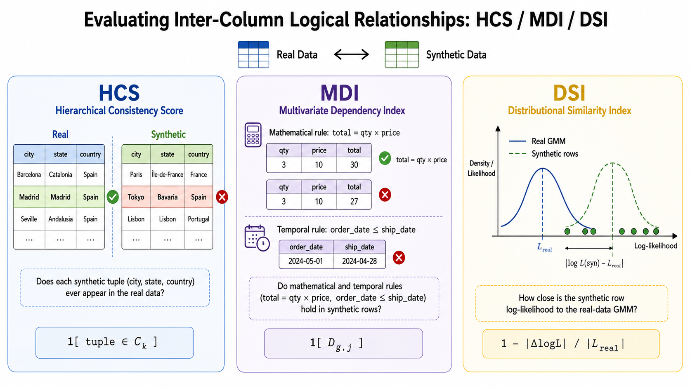
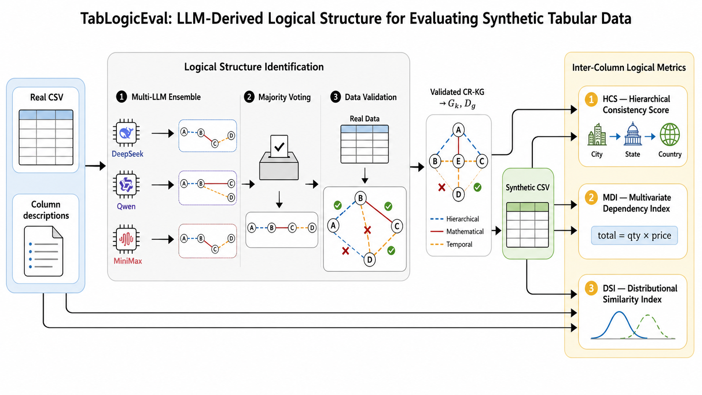

# TabLogicEval

**Evaluating Inter-Column Logical Relationships in Synthetic Tabular Data Generation**

<p align="center">
  
</p>

<p align="center"><em>The three inter-column logical metrics. <strong>HCS</strong> checks whether each synthetic tuple over a hierarchy group appears in the real data; <strong>MDI</strong> checks mathematical and temporal dependency rules row-by-row; <strong>DSI</strong> compares synthetic-row log-likelihoods against a GMM fitted on the real data.</em></p>

<p align="center">
  
</p>

<p align="center"><em>Evaluation example: HCS / MDI / DSI applied to synthetic data generated by representative tabular generators (SMOTE, CTGAN, TabDDPM, TabSyn, GReaT) on the DataCo supply chain dataset. The three metrics expose where each generator violates inter-column logic that the conventional fidelity metrics miss.</em></p>

---

TabLogicEval implements three metrics for assessing how well a synthetic tabular dataset preserves the **inter-column logical relationships** of its real-data source:

| Metric | What it measures |
|---|---|
| **HCS** — Hierarchical Consistency Score | Fraction of synthetic rows whose value-tuples over each hierarchy group (e.g. `city → state → country`) appear in the real data. |
| **MDI** — Multivariate Dependency Index | Fraction of synthetic rows that satisfy mathematical (`total = qty × price`) and temporal (`order_date ≤ ship_date`) dependency rules. |
| **DSI** — Distributional Similarity Index | GMM log-likelihood agreement between real and synthetic rows; captures non-linear dependencies that don't admit explicit rules. |

The hierarchy groups `G_k` and dependency rules `D_{g,j}` required by HCS and MDI are not hand-specified — they are automatically extracted from the table's column metadata by a multi-LLM ensemble with majority voting and data-driven validation, then used to score any synthetic dataset over the same schema.

## What's in the repo

```
TabLogicEval/
├── evaluate.py             # end-to-end CLI: real.csv + syn.csv -> HCS / MDI / DSI
├── identify.py             # LLM ensemble -> validated CR-KG -> (groups, rules)
├── metrics/
│   ├── hcs.py              # Hierarchical Consistency Score
│   ├── mdi.py              # Multivariate Dependency Index (mathematical + temporal)
│   └── dsi.py              # Distributional Similarity Index (GMM log-likelihood)
├── reasoning/              # LLM-ensemble graph construction + data-driven validation
│   ├── llm_ensemble.py
│   ├── graph_validator.py
│   └── prompts.py
└── requirements.txt
```

## Install

```bash
git clone <repo-url> TabLogicEval
cd TabLogicEval
pip install -r requirements.txt
```

Python 3.10+.

## Configure

API keys live in `.env` at the repo root:

```bash
OPENAI_API_KEY=...
DEEPSEEK_API_KEY=...
ANTHROPIC_API_KEY=...
SILICONFLOW_API_KEY=...
```

Only the providers you actually use need keys.

## Usage

```bash
python evaluate.py \
  --real data/real.csv \
  --syn  data/synthetic_ctgan.csv \
  --descriptions data/column_descriptions.txt \
  --models "deepseek,qwen,minimax" \
  --validation_threshold 0.90 \
  --out results/ctgan_report.json
```

`--descriptions` accepts either a path to a text file or the descriptions string inline. The text should list every column with a one-line description, e.g.:

```
order_city: Destination city of the order
order_state: Destination state
order_country: Destination country
order_date: Date the order is placed
shipping_date: Date the order is shipped
order_item_quantity: Number of products per order
order_item_product_price: Unit price before discount
sales: Value in sales (= quantity * price)
...
```

The report contains:

```json
{
  "scores": {"HCS": 0.71, "MDI": 0.59, "DSI": 0.68},
  "hcs": { "per_group": [...], "groups": [...] },
  "mdi": { "per_rule": [...], "skipped": [...] },
  "dsi": { "n_components": 5, "columns": [...] },
  "identification": { "candidate_stats": ..., "validated_stats": ... }
}
```

## Metric definitions (paper)

**HCS.** For each hierarchy group `G_k` and synthetic row `j`,

```
HCS = (1 / (M · N)) · Σ_{k,j} 1[ (x_{i,j})_{i∈G_k} ∈ C_k ]
```

where `C_k` is the set of distinct value-tuples observed over `G_k` in the real data.

**MDI.** For each dependency rule `D_{g,j}` over a group `G_g`,

```
MDI = (1 / (M · N)) · Σ_{g,j} 1[ D_{g,j} holds in row j ]
```

Mathematical rules check `target ≈ f(sources)` with relative tolerance; temporal rules check `source ≤ target`.

**DSI.** Fit a GMM on real numeric columns; let `L_real` be the average per-row log-likelihood. Then

```
DSI = (1 / K) · Σ_i (1 - |log p(x_syn,i) - L_real| / |L_real|)
```

## Related work: TabKG

TabLogicEval *measures* whether synthetic tabular data preserves inter-column logical relationships. Our follow-up work **[TabKG](https://github.com/Yunbo-max/TabKG)** addresses the gap that these metrics expose: it builds a validated Column Relationship Knowledge Graph (CR-KG) of the schema and uses it to guide a compression-and-reconstruction generation pipeline so that hierarchical, mathematical, and temporal relationships hold by construction in the generated data.

> Yunbo Long, Liming Xu, Alexandra Brintrup. *Generating Logically Consistent Synthetic Supply Chain Data with LLM-Driven Knowledge Graph Reasoning.* International Journal of Production Research, 2026. [[code](https://github.com/Yunbo-max/TabKG)]

The `reasoning/` modules in this repository (multi-LLM ensemble + data-driven validation) are the same components used by TabKG to construct its CR-KG; here they are reused to derive `G_k` and `D_{g,j}` automatically from column metadata.

## Citation

```bibtex
@inproceedings{long2025logicaltabular,
  title     = {Evaluating Inter-Column Logical Relationships in Synthetic Tabular Data Generation},
  author    = {Long, Yunbo and Xu, Liming and Brintrup, Alexandra},
  booktitle = {International Conference on Learning Representations (ICLR)},
  year      = {2025}
}

@article{long2026tabkg,
  title   = {Generating Logically Consistent Synthetic Supply Chain Data with LLM-Driven Knowledge Graph Reasoning},
  author  = {Long, Yunbo and Xu, Liming and Brintrup, Alexandra},
  journal = {International Journal of Production Research},
  year    = {2026}
}
```

## License

MIT.
